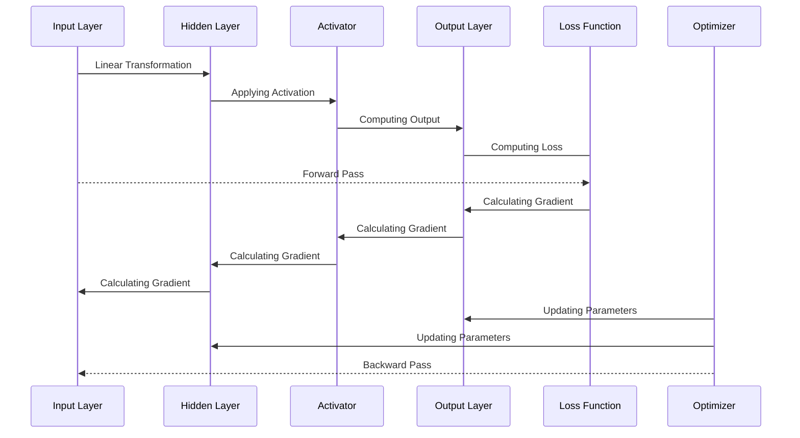

Deep learning is currently one of the most booming technologies, playing a major role in the _"OpenAI's ChatGPT era"_. Although it is built upon the transformer architecture—proposed by Google developers in 2017—the roots of this architecture go back to the very fundamentals that have shaped deep learning into what it is today. In this blog, we're going to explore a few key concepts behind this revolutionary technology...

## Motivation

The main motivation of this blog is help both developers and people in general who are looking to learn a few things about Machine Learning and specifically about Deep Learning. I want to demystify some of the common misconceptions that people take for granted without filtering out the facts from the overly hyped ___"AI"___ marketplace. Talking specifically about developers, this blogs helps them kick-start their journey into field of Deep Learning and helps them understand a thing or two when they hear about more advancements made within this domain or when you attend a relevant event/keynote.

When I was planning to write a blog on deep learning, I have no prior exposure to this domain. I have an idea of where to begin, but I got overwhelmed by the numerous resources, many of which are unclear about the prerequisites needed to understand their material. And during that time, I got into one of scholarship for a GenAI course on Udacity platform offered by Bertelsmann. Taking this course helped me understand the core fundamental of deep learning within the first module. I spent quite some time understanding the core components of a simple deep learning model called "Multi-Layer Perceptron". I really thank Bertelsmann for sponsoring the GenAI Nano Degree program on Udacity platform, this course motivated me to share my learning thus supporting my initial cause for writing this blog. 



Don't worry, that course 👆 is not the only resource from which I explain the concept to you. Please be assured as I have my done my research and iterated over many materials to get things just the right amount for you to learn enough about deep learning. I spent countless hours in refining my learning and evaluating various reference material to make this blog as accurate and beginner-friendly as possible. I would really appreciate it if you show your support on my social network like <a href="https://www.linkedin.com/in/shamith-nakka/" title="goto my linkedin profile" target="_blank">LinkedIn</a> and <a href="https://x.com/shamith_nakka" title="goto my twitter/x profile" target="_blank">Twitter/X</a>, motivating me to bring more quality content to you.

## In this blog

In this section, we'll talk about the things you can expect from this blog and prerequisites and stuff... And before we proceed, I want to let you know that Deep Learning is vast domain and there are lots 'n lots of concepts within deep learning and can't be covered within this blog. Even though the scope of this blog ends with <abbr title="Multi-Layer Perceptron"><b>MLP</b></abbr>, I want to you understand the very fundamentals that made Deep Learning what it is today.

The agenda of this blog goes as follows: 
- First we're going to start with conceptual topics with some mathematics.
- We'll end this blog with by building a simple <abbr title="Multi-Layer Perceptron"><b>MLP</b></abbr> model by creating a custom dataset. 

As much I want to implement each algorithm for each component within the <abbr title="Multi-Layer Perceptron"><b>MLP</b></abbr> architecture using python & its libraries, I decided to keep things simple and keep the explanation of various topics on a conceptual level while maintain a good level of abstraction and separate the implementation while using modern practices to build/design the <abbr title="Multi-Layer Perceptron"><b>MLP</b></abbr> architecture using PyTorch library when we reach the end of this blog.

### Overview

With that being said, let take a closer look at the things which we're going to cover in the blog.

- We'll start from the very beginning and the fundamental question ___"What is Deep Learning ?"___
- Then, we'll take a peek into the overall architecture of a very simple & very basic deep learning model called "Multilayer Perceptron" _(also known as <abbr title="Multi-Layer Perceptron"><b>MLP</b></abbr>)_
- After that, we'll pick the **core algorithm** from which <abbr title="Multi-Layer Perceptron"><b>MLP</b></abbr> and many other deep learning architecture is built upon
  - Within this topic, we start from absolute beginning and see how _"this algorithm"_ was originated.
  - Then we'll look how it evolved into the ones we use today, across various deep model architecture.
  - We end this sub-topic by looking at its limitations, which was one of the reason that caused first AI winter.
- Then we take a closer look at <abbr title="Multi-Layer Perceptron"><b>MLP</b></abbr> and how its overcame the limitation of this core _"algorithm"_ we just talked about.
- Now we know how <abbr title="Multi-Layer Perceptron"><b>MLPs</b></abbr> are built, but it doesn't get us far if we don't understand how it evaluates its mistake to learn from them.
- Now that we know how our <abbr title="Multi-Layer Perceptron"><b>MLPs</b></abbr> measure its mistakes, let's understand how model learns from its mistakes.
- If you made it this far within the blog, then you understand the core components that make a deep learning model. But it's not complete if you understand the whole learning process.
- Now that we understand how deep learning models work at conceptual level, let's wrap up everything by building an <abbr title="Multi-Layer Perceptron"><b>MLP</b></abbr> using `pytorch` module.

I know it's a lot to take it, but don't you worry about a thing. I'm going to guide you step-by-step not only understand on a conceptual level but also building a model for yourself. I don't expect you to learn the whole thing within a single session and I don't want you to do that. Just take your time, come back when you feel like resuming your journey into deep learning with me.

> Please don't be dismayed by such large number of concepts, all the concepts discussed within this blog are very **beginner-friendly**. I have made sure to keep concept in such a way that **even a toddler could understand** _(with some prior knowledge of basic math and python as mentioned within [Prerequisites](#prerequisites "goto Prerequisites section"))_. Please take your time and build your foundation on clear understanding of these concepts.
{: .prompt-info}

### Prerequisites

Even thought this blog will be a totally beginner-friendly with some great in-dept insights with pretty good explanation of why things are done in a certain way and the things that made them as a go-to option for a few specific tasks. You need to have some basic foundation of following things for you to make sense out of this blog. Even though, most of these concepts are re-explained ___(depending upon context)___, Please make sure you have good/solid understanding of the following prerequisites...

> Remember!!!... Not all the following topics within prerequisites are broken down and re-explained, Only the ones that are more complex or the ones which required a pre-context to understand current usage are re-explained.
>
> You're expected with **at-least bare minimum basics** of the mentioned topics. If you find some concepts difficult to understand make sure you have some base foundation of that concept before you commenting your question at the complete end of this blog.
{: .prompt-danger}

#### Mathematics

I hate to break it to you that deep learning is not about calling various functions from libraries and training it tons 'n tons of data. Well it's not totally wrong, but what you don't realize is that deep learning was mathematics all along. Everything is deep learning is built upon tons of researches and inspirations that are better represented & implemented using mathematics. 

> Note that the actual meaning of the vaguely used term ___"Model"___ is basically a combination of various mathematical functions and concepts that goes hand-in-hand in different phases, including the phase where the end result is used as a final product. **Remember, It was Math---all along**.
{: .prompt-tip}

With that being said, tell take a look at the important mathematical concepts that are required for Deep learning:

- Basic Math _( pre-school / high-school )_
- Linear Algebra
  - Vectors
  - Matrix
  - Linear Transformations
  - Matrix Multiplication
- Discrete Mathematics
  - Boolean Algebra
  - Boolean Functions
  - Truth tables
- Coordinate Geometry
  - Linear Equation
  - Hyperplanes
  - Distance and Angle
- Calculus
  - Differential Equations
  - Chain Rule
  - Taylor Series
- Probability and Statistics
  - Probability Distribution

I know that's a lot of math right there, but don't get scared. This blog is designed in such a way that, you as the reader, is ONLY expected with bare minimum of the mentioned topics. And most of the time, I break down some of the fundamental concept for you to understand the _what, why, how_ behind these mathematical implementations that are curial for understand and implementing deep learning concepts.

#### Python

Since we're going to build a Deep Learning model at the end of this blog, you need to have **AT LEAST** foundational level of hands-on knowledge on Python Programming language. Don't worry if you're not familiar with most of the advance stuff within Python, Just make sure you some good hands-on knowledge on the following concepts:

- Python Basics
  - Data Types
  - Operators
  - Conditional Statements
  - Iterative Statements
- Python Native Data Structures
  - List
  - Tuple
  - Set
  - Dictionary
- Comprehensions
- Functions
- OOPS Concepts
  - Class
  - Object
  - Methods
  - Inheritance
- Packages & Modules

Well that's most of the basic foundational concept you need to know for the <abbr title="Multi-Layer Perceptron"><b>MLP</b></abbr> which we're going to build at the end of this blog. Normally, I could add other important libraries for data handling like `numpy`, `pandas` and stuff. But since we're using `pytorch` module for our <abbr title="Multi-Layer Perceptron"><b>MLP</b></abbr>, we're going to use all the tools and features that comes natively with `pytorch` library. So that we stay right on topic instead of understanding how to use all the other 3rd-party libraries. 

Also, don't worry about `pytorch` library. We'll have a brief introduction to this library when we're building the <abbr title="Multi-Layer Perceptron"><b>MLP</b></abbr>. Just make sure you're having a good/solid understanding and hands-on knowledge as mentioned above, before you proceed to the <abbr title="Multi-Layer Perceptron"><b>MLP</b></abbr> in the end.

#### Handling Environment

In this blog, we're not going over the steps to set up the required environment to build the final project. So, you need to do your own research to replicate the result or to run the code within your local machine. Here are list of things that are required to set up the required environment,

- Setting up virtual environments _(python-specific)_
  - Conda Environment ___(Recommended)___
  - Virtual Environment _(venv)_
  - Pip env
- Using Python Package Manager _(pip)_
- Containerization _(optional)_

These are most of the things required while working with any Python projects in general. But as of this blog and <abbr title="Multi-Layer Perceptron"><b>MLP</b></abbr> which we're going to implement, it's more than enough to use `miniconda` for creating a virtual environment with `python 3.10` and `pytorch` as core dependencies. But if you're some whose more comfortable using `jupyter-notebook`, then I suggest you to go with `anaconda` for creating virtual environment _(as most of you, might have already installed it within your system)_.

Coming to containerization, it's not exactly a required necessity but kind of good practice. It might not make much sense for small python project _(like the <abbr title="Multi-Layer Perceptron"><b>MLP</b></abbr> within this blog)_ and creating a virtual environment could suffice for the current requirement, but it can help you familiarize with a few concepts when you're working on a comparatively bigger projects. 

If you're familiar with containerization, go ahead set up your environment accordingly. But if you're someone who's not familiar with these concepts but still want to implement them, then I suggest you to give Dev Container a try. And if you don't want to make it more complex or not interested in containerizing your project, then that to is fine because _"Simplicity is the ultimate sophistication"_.

#### Basics of Machine Learning (Optional, but Good to have)

This one is totally optional, you don't need much machine learning knowledge to understand this blog. But it's most certainly a Good-to-Have when it comes to understand how similar it is from many other ML algorithm out there. 

If you're familiar with ML concept, then Great !!!... Most of the things will make sense to you with much simpler explanation. And if you don't, it's still fine as I designed this blog assuming that you HAVE heard about Deep Learning but never learn knew what it really is...

And for people who're familiar with ML concepts, we're going to cover only the supervised learning part of deep learning concepts and while going through this blog, you'll understand how some concepts are very similar to the ones of linear regression. That might have been a spoiler for people who're not familiar with linear regression, so let's proceed to the actual content without any more spoilers.

## Introduction to Deep Learning

Let's start from the beginning, What is <abbr title="Artificial Intelligence">AI</abbr>? What is <abbr title="Machine Learning">ML</abbr>? And most importantly What is <abbr title="Deep Learning">DL</abbr>? Why do we need it?

### What is Artificial Intelligence?

In the early days, Artificial Intelligence had a complete different ideology compared to what we see today. Initially, AI was approached as more of a philosophical study, where researchers aimed to understand and replicate human-level intelligence using the mathematics and algorithms available at the time. This led to the development of a universal approach for problem-solving, known as [State Space Search](https://lmgt.org/?q=What+is+State+Space+Search+%3F "what is State Space Search?"). State Space Search is essentially a search algorithm that aims to find a solution state from a given initial state within a specified environment. Although this method has been optimized with [heuristic](https://letmegpt.com/?q=What%20is%20a%20Heuristic%20%3F "define heuristic") that resulted in [A* algorithm](https://lmgt.org/?q=What+is+A*+Algorithm+%3F), it is still not well-suited for more complex problems or diverse real-world applications.

During that time, Field of AI was more focused on developing solutions and algorithms aimed at achieving human-like intelligence. The goal of replicating human intelligence was prioritized over more practical considerations, such as compute power and storage. This led to a wave of innovations that, over time, became more feasible and practical to implement in the real world, with optimizations tailored to specific problems.

### What is Machine Learning?

While AI is a border field that is more invested in replicating human-level intelligence, Machine Learning is a sub-field of Artificial Intelligence _(but still a broad field by itself)_ where the algorithms are designed in such a way that they learn from data. If you're wondering how ML differs from AI, well, I just told you—it's **DATA**. 

Keep in mind that not all AI algorithms rely on data to mimic human-like intelligence, but machine learning is entirely data-dependent as it uses different approaches based on the provided data. So, whenever you hear someone say, "It's powered by AI" or something similar, it's machine learning all along, because there is no such great and bulky heuristic that can be replicated for a specific task based on the given data.

#### Types of Machine Learning

Machine learning uses many mathematical concepts to find interesting pattern in the data from which they can either predict or classify the incoming/future data. But finding patterns from such wide diversified data that comes in many forms & types requires different ways of approach while depending upon the given problem statement. So, let's take a moment to understand different type of machine learning algorithms/approaches...

> Before we try to understand, let's get familiar with some terminology:
> 
> - **Data point:** Single instance of data values within given dataset.
> - **Dataset:** A huge collection of data points for a specific problem.
> - **Classes/Labelled Data:** The targeted data. In other words, the data we're trying to predict or classify. 
> - **Classification:** A process of mapping a given data point with set of predefined label/class.
> - **Dependent value:** The targeted value which needs to be estimated/classified.
> - **Independent value(s):** The values which are used to determine the target value.
> - **Regression:** A statistical process of estimating dependent value from one or more independent value.
> - **Clustering:** Grouping related data point together based on their attributes.

Now that's out of our way, Let's try to understand the three different types of machine learning approaches,

- Supervised Learning
- Unsupervised Learning
- Reinforcement Learning

Let's start with supervised learning. It's one of the most commonly used algorithms to predict or classify a data point into predefined class/label. We choose this approach when the whole dataset is labelled and has predefined output. Supervised learning deals with classification and regression based problem. In other words, determining which data point belong to which class and predicting values _(like numeric values)_. Let's see a few example to properly understand what supervised learning algorithms typically deal with...

- Classifying whether a student pass this semester or not.
- Classifying whether a give image is a cat, dog or human.
- Predicting the price estimate of houses at a specified location.
- Predicting the salary hike based on data from last 2 years, etc.

Now that we have a good understanding of supervised learning, let's take a look at unsupervised learning. As the name suggests, unsupervised learning is kinda opposite to supervised learning. While supervised learning deals with labelled data, unsupervised learning deals with data with no labels. Basically Unsupervised learning handles problems like Clustering, Association rule learning, etc. In other words, group related data points together based on their merits or specifying a relationship between data points. Let's see a few example for unsupervised learning...

- Clustering related book genres.
- Clustering credit card transaction to find fraudulent transactions.
- Suggesting related or complementary items that you have added to your cart on an e-commerce website.
- Recommending movies or series based on your watch history.

Now, it's time of reinforcement learning. Unlike supervised or unsupervised learning, reinforcement learning deals with real-time interaction. The model learns from interacting with its environment based on trail and error method. Whenever the model makes a mistake, it will be penalized and when it succeeds it will be rewarded. The roots of these concepts go way back 20th Century, and it's a wide concept on its own. All the application which required real-time interaction by analyzing its environment uses reinforcement concepts internally. Some of the widely used applications of this approach are as follows,

- Self-driving cars
- Robotics
- Personalized health monitoring
- Manufacturing

Now that we have coved all the types of machine learning, we can categorize them as following,

{: .dark}
{: .light}

Awesome, Now let's see where Deep Learning comes into all of this madness...

### What is Deep Learning?

Deep Learning is a sub-field of Machine Learning where the whole architecture is build up on a key foundational algorithm known as Perceptron. All DL model architecture stacks layers and layers of these perceptrons to build complex model _(commonly referred as "neural nets")_ to resolve their specified problems. That's all the difference that is... 

DL is ML but uses a different approach/architecture that is heavily inspired from human brain. The Perceptron is _"the algorithm"_ that I was hinting in the [Overview section](#overview "goto overview section"). We're going to learn so much about the Perceptron algorithm in the upcoming section, So don't worry too much about it.

> Even though, DL is a subset of ML. It's not much different from the actual approaches that are commonly used in ML. In other word, DL is also categorized into three type i.e.,
>
> - Supervised Learning
> - Unsupervised Learning
> - Reinforcement Learning
>
> With the only difference being the architecture that is being implemented. The whole logic and mathematical concepts are same, but implemented within neural networks _(layers of perceptrons)_.
>
>> And in this blog we're implementing supervised learning algorithm in a simple deep neural net called Multi-layered perceptron.
{: .prompt-info}

<abbr title="for your information">FYI</abbr>, Deep Learning is NOT a new topic that was founded recently. It's an pretty old concept that was resurfaced---they exploded in popularity due to the significant performance observed from [AlexNet](https://youtu.be/5MvkxY0A6AM?si=wfUn9XQV2dHKi-HE "short video about AlexNet") during the ImageNet competition back in 2012 and more recently due to the transformer architecture that build LLMs like ChatGPT. 

Let's take a step back and see, why such an old sub-field of machine learning is gain popularity in recent years...

Deep learning architectures are designed in such a way that, they ingest huge amounts of data by burning large scale of resources _(both in terms of compute and storage)_ just to work as expected. And at the time when these concepts were introduced---have very smaller amount & less diverse data with limited resources, which were a huge blocker that stop them from showing their true potential. But as the time passed by, the computing and storage capabilities has increased and huge volumes of data are being generated and stored every day. In other words, all the requirements for Deep Learning architectures to show their potential have met and they did show us the amazing result in forms of LLMs built by various tech gaints.

While dealing with AI algorithms/models, there lies an important concept for researcher, developers and people in general to understand the internal working of these algorithms and models, this is called **"Explainability of AI"**. When coming to deep learning, it more of a black box. You design the architecture, provide the data and you get the result, but no one in the world can understand why each layer and each perceptron is valued in a certain way. You CAN make an educated guess of what might happen at each layer, but nobody is exactly sure what really each perceptron in the each layer represents.

Despite poor explainability of deep learning models, some complex architectures like LLMs are in huge demand only due to it's end result. So, sometimes it's the result that everyone's after not the internal working. But this should not stop you from searching for the actual truth behind it.

> Remember folks, Deep Learning models/algorithms are designed for huge volumes of data that requires huge compute power. So it's always wise to analyze your problem statement and proceed only when you meet the following criteria:
>
> - [x] Has huge volumes of data. _(at least 100,000 datapoint)_
> - [x] Has huge compute power. _(GPUs depending upon your data and task)_
> - [x] Requires less or no explainability.
>
> These are the few important thing you need to keep in mind to ensure whether deep learning is the right choice for your use case or not. By checking this list, you can save your resource and find another better way that could be a potential solution for you use case.
{: .prompt-warning}

Now that we have seen what AI, ML and DL are... Let's wrap up this section with a simple venn diagram with various algorithms spanning from AI to DL.

{: .dark}
{: .light}

### Overview of Basic Neural Network

Now that we're solid with fundamental understanding of what is Deep Learning, Let's take an top view of a typical neural network and get familiar with different part of the this architecture before we zoom into each of them later down this blog.

Whenever you google about Deep-Learning/Neural-Net or hear people give presentation about them, You find the following image commonly everywhere... Well, this is a pictorial representation of a typical Neural Network...

{: .dark}
{: .light}

Every Deep Learning model/architecture is a network of layer of perceptron stacked up together. When the perceptron are stacked together in a linear layer, then it's called "Linear Layer". Linear layers are the most common in deep learning models and can be found in most of the deep learning models and architectures. And when we connect these layers of perceptrons together as a network, we call it Neural Networks. As time passed by, many researches and developers have invented various way to connect the perceptrons and layers of perceptrons to make the most of these deep Neural Networks.

As we can see the following image, the circle represent perceptron and the lines concept these layers of perceptrons are called weights and most of the times they are vaguely called as parameters. 

> The actual meaning of parameters is $ weight + bias $, but most of the times bias are considered as part of weights and they are denoted as $ w_0 $ . Don't worry if it doesn't make much sense right now, we'll take a closer look in the upcoming sections.
{: .prompt-info}

{: .dark}
{: .light}

A Deep Learning model typical consists of three types of layers as shown on above image and they are,

- Input Layer
- Hidden Layer
- Output Layer

Input layer is the layer available for mapping all the input attributes. Say if you're trying to build an model to predict which employee is going to get the employee of the month title, so you need to train model on data with different attributes like domain, number of leaves taken, amount of overtime, endorsement from his/her colleagues. The input layer is responsible for handling input attributes and passing them down the network. Thus, we can say that number of perceptrons in input layer is equal to number of attributes in a given dataset.

As the name suggest, Output layer is the layer that is responsible to handle the output of the model. If we're talking about supervised learning, then count of perceptrons in this layer is equal to number resultant labels/classes if it's a classification or ends with an aggregator if it's an regression problem. If we take the above problem, since we're checking if a given employee could be employee of the month or not, there are two classes i.e., _"yes, he/she is the employee of the month"_ or _"no, he/she is not the employee of the month"_.

Last but not the least, Hidden Layers. Hidden layer are also known as pre-activation layer and they are meant to distribute the data thought the network. This is part where the data is ingested into the network. During the training, after we pass the data the total error is calculated and spread though the network that make small changes to each perceptron at each layer so that when the data is passed it would preform better and closer and closer to actual answer.

The term "Deep" in Deep Neural Network (or) in Deep Learning comes from the deep stacked layers and layers of perceptron in the hidden layer section. Now, that we're familiar with structure of a simple Neural Network, let's wrap this section by understanding How Deep Learning actually work...

#### Internal Working of Deep Neural Network

A typical Deep neural network consists of something more than interconnected layers and layers of perceptron. And in this sub-section, we're going to have an overall idea of how deep learning models learns and works---by understanding the following concepts,

- Perceptron
- Weight and Bias
- Activation Function
- Neural Network
- Loss function
- Optimization algorithm
- Forward pass and backward pass

While Building and Deep neural network, we combine different algorithm together that fits our use case. We'll start from perceptron, it's the foundational element deep learning alright. 

Perceptrons are a simple algorithm that takes the input values, multiplies with various weights and passes the sum of the weights _(along with bias)_ thought an activation function to get the result. Let's break down each part of this statement to understand even better...

- As we said, perceptron takes multiple input and multiplies it with it's weight. Now, why do we do that ?
  - We assign different weights for each input value to represent the weighage of the result for that specific input attribute.
  - Imagine if I say how can you determine whether more people are going to watch today's football match, You might say it depends on whether it's world cup or charity match _(or)_ maybe even you could say if Ronald is present there's chance of increase in people watching today's match.
  - Each input has a different weighage and we use weights to represent that.
- Then we mentioned that we sum up the weights along with bias.
  - The bias is an additional value that helps the perceptron make predictions even when all input features are zero. It effectively shifts the decision boundary, allowing the perceptron to handle cases.
  - And we sum up all the weight including bias to compute the net input for the activation function.
- Last we mentioned that we pass it though activation function.
  - Activation function is the function that determines whether perceptron "fires" or not. 
  - In other words, activation function plays the role of decision maker telling whether the input meets the requirement for a certain condition.

These perceptrons are not capable of handling complex problems and hence, they are stacked together in a network called Neural Network. Till this point, these are just stacks of perceptron layers with no meaning. So, we need to train them with huge volumes of data so that they learn from the data. Before we understand the learning process, we need to know two more things and they are,

- Loss Function
- Optimization algorithm

Loss function goes by many names like objective function, error function and cost function. Anyways, Loss function is one of the core algorithm that calculates the total loss made my the model. Later this loss is distributed thought the Neural network and the respective weights and bias or in other words parameters are updates at each perceptron at each layer using optimization algorithms.

Optimization algorithms is another core component of Neural network as they take up the responsibility of updating parameter _(weight and bias)_ thought the neural network. Always remember that Activation function, Loss function vary a lot from type of problem we're trying to solve.

Now that we're familiar with all the require component of a Neural net, let's see how the Neural net learns from the data. But let's learn two more terminology for the whole explain to make more sense...

- **Forward Pass/Propagation:** The input traverses though the whole neural network from starting to end.
- **Backward Pass/Propagation:** The resultant error is passed backward from the output layer to the very beginning of the neural network and updates the parameters.

And if you read though two terminologies, then you know exactly what's gonna happen but I'm gonna tell you out anyway. Let's try to understand step-by-step,

- We defined our Neural Network with all the required Input, Hidden and Output layer along with suitable Activation function, Loss function and Optimization algorithms.
- Then we pass the data thought Neural Network. In other words, a simple Forward pass where we iterate over data point from given training dataset.
- After a single Forward pass, we take the predicted result of the current model and actual output as compute the loss using loss function.
- Then during this backwards pass, we spread our error thought the Neural Network.
- Then we use Optimization algorithm to minimize the loss by tweaking the weights and bias at each perceptron at each layer.
- And we do it all again for a certain number of epochs _(where a single epoch represents a complete iteration over the whole training dataset)_.

And that's how a Deep Neural Network learn from the data. It was always about updating those weights and bias to pick up the right patterns to capture the essence of the problem statement from the provided dataset. Here's an in-dept sequence diagram to wrap everything we learnt about internal working of a Deep Neural Network.

Don't worry if you don't understand the whole sequence diagram shown above. We'll get more detail in the following blog. Just make sure you have a proper idea of the internal working of a Deep Neural Network.