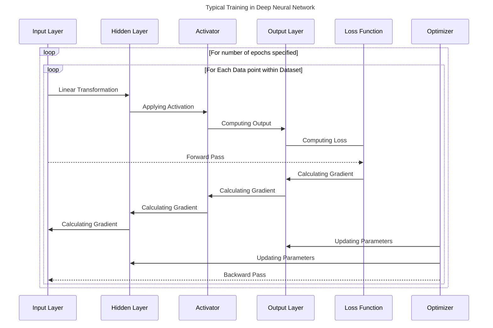

Deep learning is currently one of the most booming technologies, playing a major role in the _"OpenAI's ChatGPT era"_. Although it is built upon the transformer architecture—proposed by Google developers in 2017—the roots of this architecture go back to the very fundamentals that have shaped deep learning into what it is today. In this blog, we're going to explore a few key concepts behind this revolutionary technology...

## Motivation

The main motivation of this blog is help both developers and people in general who are looking to learn a few things about Machine Learning and specifically about Deep Learning. I want to demystify some of the common misconceptions that people take for granted without filtering out the facts from the overly hyped ___"AI"___ marketplace. Talking specifically about developers, this blogs helps them kick-start their journey into field of Deep Learning and helps them understand a thing or two when they hear about more advancements made within this domain or when you attend a relevant event/keynote.

When I was planning to write a blog on deep learning, I have no prior exposure to this domain. I have an idea of where to begin, but I got overwhelmed by the numerous resources, many of which are unclear about the prerequisites needed to understand their material. And during that time, I got into one of scholarship for a GenAI course on Udacity platform offered by Bertelsmann. Taking this course helped me understand the core fundamental of deep learning within the first module. I spent quite some time understanding the core components of a simple deep learning model called "Multi-Layer Perceptron". I really thank Bertelsmann for sponsoring the GenAI Nano Degree program on Udacity platform, this course motivated me to share my learning thus supporting my initial cause for writing this blog. 



Don't worry, that course 👆 is not the only resource from which I explain the concept to you. Please be assured as I have my done my research and iterated over many materials to get things just the right amount for you to learn enough about deep learning. I spent countless hours in refining my learning and evaluating various reference material to make this blog as accurate and beginner-friendly as possible. I would really appreciate it if you show your support on my social network like <a href="https://www.linkedin.com/in/shamith-nakka/" title="goto my linkedin profile" target="_blank">LinkedIn</a> and <a href="https://x.com/shamith_nakka" title="goto my twitter/x profile" target="_blank">Twitter/X</a>, motivating me to bring more quality content to you.

## In this blog

In this section, we'll talk about the things you can expect from this blog and prerequisites and stuff... And before we proceed, I want to let you know that Deep Learning is vast domain and there are lots 'n lots of concepts within deep learning and can't be covered within this blog. Even though the scope of this blog ends with <abbr title="Multi-Layer Perceptron"><b>MLP</b></abbr>, I want to you understand the very fundamentals that made Deep Learning what it is today.

The agenda of this blog goes as follows: 
- First we're going to start with conceptual topics with some mathematics.
- We'll end this blog with by building a simple <abbr title="Multi-Layer Perceptron"><b>MLP</b></abbr> model by creating a custom dataset. 

As much I want to implement each algorithm for each component within the <abbr title="Multi-Layer Perceptron"><b>MLP</b></abbr> architecture using python & its libraries, I decided to keep things simple and keep the explanation of various topics on a conceptual level while maintain a good level of abstraction and separate the implementation while using modern practices to build/design the <abbr title="Multi-Layer Perceptron"><b>MLP</b></abbr> architecture using PyTorch library when we reach the end of this blog.

### Overview

With that being said, let take a closer look at the things which we're going to cover in the blog.

- We'll start from the very beginning and the fundamental question ___"What is Deep Learning ?"___
- Then, we'll take a peek into the overall architecture of a very simple & very basic deep learning model called "Multilayer Perceptron" _(also known as <abbr title="Multi-Layer Perceptron"><b>MLP</b></abbr>)_
- After that, we'll pick the **core algorithm** from which <abbr title="Multi-Layer Perceptron"><b>MLP</b></abbr> and many other deep learning architecture is built upon
  - Within this topic, we start from absolute beginning and see how _"this algorithm"_ was originated.
  - Then we'll look how it evolved into the ones we use today, across various deep model architecture.
  - We end this sub-topic by looking at its limitations, which was one of the reason that caused first AI winter.
- Then we take a closer look at <abbr title="Multi-Layer Perceptron"><b>MLP</b></abbr> and how its overcame the limitation of this core _"algorithm"_ we just talked about.
- Now we know how <abbr title="Multi-Layer Perceptron"><b>MLPs</b></abbr> are built, but it doesn't get us far if we don't understand how it evaluates its mistake to learn from them.
- Now that we know how our <abbr title="Multi-Layer Perceptron"><b>MLPs</b></abbr> measure its mistakes, let's understand how model learns from its mistakes.
- If you made it this far within the blog, then you understand the core components that make a deep learning model. But it's not complete if you understand the whole learning process.
- Now that we understand how deep learning models work at conceptual level, let's wrap up everything by building an <abbr title="Multi-Layer Perceptron"><b>MLP</b></abbr> using `pytorch` module.

I know it's a lot to take it, but don't you worry about a thing. I'm going to guide you step-by-step not only understand on a conceptual level but also building a model for yourself. I don't expect you to learn the whole thing within a single session and I don't want you to do that. Just take your time, come back when you feel like resuming your journey into deep learning with me.

> Please don't be dismayed by such large number of concepts, all the concepts discussed within this blog are very **beginner-friendly**. I have made sure to keep concept in such a way that **even a toddler could understand** _(with some prior knowledge of basic math and python as mentioned within [Prerequisites](#prerequisites "goto Prerequisites section"))_. Please take your time and build your foundation on clear understanding of these concepts.
{: .prompt-info}

### Prerequisites

Even thought this blog will be a totally beginner-friendly with some great in-dept insights with pretty good explanation of why things are done in a certain way and the things that made them as a go-to option for a few specific tasks. You need to have some basic foundation of following things for you to make sense out of this blog. Even though, most of these concepts are re-explained ___(depending upon context)___, Please make sure you have good/solid understanding of the following prerequisites...

> Remember!!!... Not all the following topics within prerequisites are broken down and re-explained, Only the ones that are more complex or the ones which required a pre-context to understand current usage are re-explained.
>
> You're expected with **at-least bare minimum basics** of the mentioned topics. If you find some concepts difficult to understand make sure you have some base foundation of that concept before you commenting your question at the complete end of this blog.
{: .prompt-danger}

#### Mathematics

I hate to break it to you that deep learning is not about calling various functions from libraries and training it tons 'n tons of data. Well it's not totally wrong, but what you don't realize is that deep learning was mathematics all along. Everything is deep learning is built upon tons of researches and inspirations that are better represented & implemented using mathematics. 

> Note that the actual meaning of the vaguely used term ___"Model"___ is basically a combination of various mathematical functions and concepts that goes hand-in-hand in different phases, including the phase where the end result is used as a final product. **Remember, It was Math---all along**.
{: .prompt-tip}

With that being said, tell take a look at the important mathematical concepts that are required for Deep learning:

- Basic Math _( pre-school / high-school )_
- Linear Algebra
  - Vectors
  - Matrix
  - Linear Transformations
  - Matrix Multiplication
- Discrete Mathematics
  - Boolean Algebra
  - Boolean Functions
  - Truth tables
- Coordinate Geometry
  - Linear Equation
  - Hyperplanes
  - Distance and Angle
- Calculus
  - Differential Equations
  - Chain Rule
  - Taylor Series
- Probability and Statistics
  - Probability Distribution

I know that's a lot of math right there, but don't get scared. This blog is designed in such a way that, you as the reader, is ONLY expected with bare minimum of the mentioned topics. And most of the time, I break down some of the fundamental concept for you to understand the _what, why, how_ behind these mathematical implementations that are curial for understand and implementing deep learning concepts.

#### Python

Since we're going to build a Deep Learning model at the end of this blog, you need to have **AT LEAST** foundational level of hands-on knowledge on Python Programming language. Don't worry if you're not familiar with most of the advance stuff within Python, Just make sure you some good hands-on knowledge on the following concepts:

- Python Basics
  - Data Types
  - Operators
  - Conditional Statements
  - Iterative Statements
- Python Native Data Structures
  - List
  - Tuple
  - Set
  - Dictionary
- Comprehensions
- Functions
- OOPS Concepts
  - Class
  - Object
  - Methods
  - Inheritance
- Packages & Modules

Well that's most of the basic foundational concept you need to know for the <abbr title="Multi-Layer Perceptron"><b>MLP</b></abbr> which we're going to build at the end of this blog. Normally, I could add other important libraries for data handling like `numpy`, `pandas` and stuff. But since we're using `pytorch` module for our <abbr title="Multi-Layer Perceptron"><b>MLP</b></abbr>, we're going to use all the tools and features that comes natively with `pytorch` library. So that we stay right on topic instead of understanding how to use all the other 3rd-party libraries. 

Also, don't worry about `pytorch` library. We'll have a brief introduction to this library when we're building the <abbr title="Multi-Layer Perceptron"><b>MLP</b></abbr>. Just make sure you're having a good/solid understanding and hands-on knowledge as mentioned above, before you proceed to the <abbr title="Multi-Layer Perceptron"><b>MLP</b></abbr> in the end.

#### Handling Environment

In this blog, we're not going over the steps to set up the required environment to build the final project. So, you need to do your own research to replicate the result or to run the code within your local machine. Here are list of things that are required to set up the required environment,

- Setting up virtual environments _(python-specific)_
  - Conda Environment ___(Recommended)___
  - Virtual Environment _(venv)_
  - Pip env
- Using Python Package Manager _(pip)_
- Containerization _(optional)_

These are most of the things required while working with any Python projects in general. But as of this blog and <abbr title="Multi-Layer Perceptron"><b>MLP</b></abbr> which we're going to implement, it's more than enough to use `miniconda` for creating a virtual environment with `python 3.10` and `pytorch` as core dependencies. But if you're some whose more comfortable using `jupyter-notebook`, then I suggest you to go with `anaconda` for creating virtual environment _(as most of you, might have already installed it within your system)_.

Coming to containerization, it's not exactly a required necessity but kind of good practice. It might not make much sense for small python project _(like the <abbr title="Multi-Layer Perceptron"><b>MLP</b></abbr> within this blog)_ and creating a virtual environment could suffice for the current requirement, but it can help you familiarize with a few concepts when you're working on a comparatively bigger projects. 

If you're familiar with containerization, go ahead set up your environment accordingly. But if you're someone who's not familiar with these concepts but still want to implement them, then I suggest you to give Dev Container a try. And if you don't want to make it more complex or not interested in containerizing your project, then that to is fine because _"Simplicity is the ultimate sophistication"_.

#### Basics of Machine Learning (Optional, but Good to have)

This one is totally optional, you don't need much machine learning knowledge to understand this blog. But it's most certainly a Good-to-Have when it comes to understand how similar it is from many other ML algorithm out there. 

If you're familiar with ML concept, then Great !!!... Most of the things will make sense to you with much simpler explanation. And if you don't, it's still fine as I designed this blog assuming that you HAVE heard about Deep Learning but never learn knew what it really is...

And for people who're familiar with ML concepts, we're going to cover only the supervised learning part of deep learning concepts and while going through this blog, you'll understand how some concepts are very similar to the ones of linear regression. That might have been a spoiler for people who're not familiar with linear regression, so let's proceed to the actual content without any more spoilers.

## Introduction to Deep Learning

Let's start from the beginning, What is <abbr title="Artificial Intelligence">AI</abbr>? What is <abbr title="Machine Learning">ML</abbr>? And most importantly What is <abbr title="Deep Learning">DL</abbr>? Why do we need it?

### What is Artificial Intelligence?

In the early days, Artificial Intelligence had a complete different ideology compared to what we see today. Initially, AI was approached as more of a philosophical study, where researchers aimed to understand and replicate human-level intelligence using the mathematics and algorithms available at the time. This led to the development of a universal approach for problem-solving, known as [State Space Search](https://lmgt.org/?q=What+is+State+Space+Search+%3F "what is State Space Search?"). State Space Search is essentially a search algorithm that aims to find a solution state from a given initial state within a specified environment. Although this method has been optimized with [heuristic](https://letmegpt.com/?q=What%20is%20a%20Heuristic%20%3F "define heuristic") that resulted in [A* algorithm](https://lmgt.org/?q=What+is+A*+Algorithm+%3F), it is still not well-suited for more complex problems or diverse real-world applications.

During that time, Field of AI was more focused on developing solutions and algorithms aimed at achieving human-like intelligence. The goal of replicating human intelligence was prioritized over more practical considerations, such as compute power and storage. This led to a wave of innovations that, over time, became more feasible and practical to implement in the real world, with optimizations tailored to specific problems.

### What is Machine Learning?

While AI is a border field that is more invested in replicating human-level intelligence, Machine Learning is a sub-field of Artificial Intelligence _(but still a broad field by itself)_ where the algorithms are designed in such a way that they learn from data. If you're wondering how ML differs from AI, well, I just told you—it's **DATA**. 

Keep in mind that not all AI algorithms rely on data to mimic human-like intelligence, but machine learning is entirely data-dependent as it uses different approaches based on the provided data. So, whenever you hear someone say, "It's powered by AI" or something similar, it's machine learning all along, because there is no better and bulkier heuristic than Data _(at least for typical data-driven problems)_.

#### Types of Machine Learning

Machine learning uses many mathematical concepts to find interesting pattern in the data from which they can either predict or classify the incoming/future data. But finding patterns from such wide diversified data that comes in many forms & types requires different ways of approach and may vary depending upon the given problem statement. So, let's take a moment to understand different type of machine learning algorithms/approaches...

> Before proceed, let's get familiar with some terminology:
> 
> - **Data point:** Single instance of data values within given dataset.
> - **Dataset:** A huge collection of data points for a specific problem.
> - **Classes/Labelled Data:** The targeted data. In other words, the data which we're trying to predict or classify. 
> - **Classification:** A process of mapping a given data point with set of predefined label/class.
> - **Dependent value:** The targeted value which needs to be estimated/classified.
> - **Independent value(s):** The value(s) which are used to determine the target value.
> - **Regression:** A statistical process of estimating dependent value from one or more independent value.
> - **Clustering:** Grouping related data points together based on their attributes.

Now that's out of our way, Let's try to understand the three different types of machine learning approaches,

- Supervised Learning
- Unsupervised Learning
- Reinforcement Learning

Let's start with supervised learning. It's one of the most commonly used algorithms to predict or classify a data points into predefined class(es)/label(s ). We choose this approach when the whole dataset is labelled and has predefined output. Supervised learning deals with classification and regression based problem. In other words, determining which data point belong to which class and predicting values _(like numeric values)_. Let's see a few example to properly understand what supervised learning algorithms typically deal with...

- Classifying whether a student pass this semester or not based on his/her information.
- Classifying whether a give image is a cat, dog or human.
- Predicting the price estimate of houses at a specified location.
- Predicting the salary hike based on data from last 2 years, etc.

Now that we have a good understanding of supervised learning, let's take a look at unsupervised learning. As the name suggests, unsupervised learning is kinda opposite to supervised learning. While supervised learning deals with labelled data, unsupervised learning deals with data that has no labels. Basically Unsupervised learning handles problems like Clustering, Association rule learning, etc. In other words, group related data points together based on their merits or specifying relationship(s) between various data points. Let's see a few example for unsupervised learning...

- Clustering related book genres.
- Clustering credit card transaction to find fraudulent transactions.
- Suggesting related or complementary items that you have added to your cart on an e-commerce website.
- Recommending movies or series based on your watch history.

Now, it's time of reinforcement learning. Unlike supervised or unsupervised learning, reinforcement learning deals with real-time interactions. The model learns from interacting with its environment based on trail and error method. Whenever the model makes a mistake, it will be penalized and when it succeeds it will be rewarded. The roots of these concepts go way back 20th Century, and it's a wide concept on its own. All the application which required real-time interaction by analyzing its environment uses reinforcement concepts internally. Some of the widely used applications of this approach are as follows,

- Self-driving cars
- Robotics
- Personalized health monitoring
- Manufacturing

Now that we have coved all the types of machine learning, we can categorize them as following,

{: .dark}
{: .light}

Awesome, Now let's see where Deep Learning comes into all of this madness...

### What is Deep Learning?

Deep Learning is a sub-field of Machine Learning where the whole architecture is build up on a key foundational algorithm known as Perceptron. All DL model architectures stacks layers and layers of these perceptrons to build complex model _(commonly referred as "neural nets")_ to resolve their specified problems. That's all the difference that is... 

DL is ML but uses a different approach/architecture which is heavily inspired from human brain. The Perceptron is _"the algorithm"_ that I was hinting in the [Overview section](#overview "goto overview section"). We're going to learn so much about the Perceptron algorithm in the upcoming section, So don't worry too much about it.

> Even though, DL is a subset of ML. It's not much different from the actual approaches that are commonly used in ML. In other word, DL can be categorized into three type i.e.,
>
> - Supervised Learning
> - Unsupervised Learning
> - Reinforcement Learning
>
> With the only difference being the architecture that is being implemented. The whole logic and mathematical concepts are same, but implemented within neural networks _(layers of perceptrons)_.
>
>> And in this blog we're implementing supervised learning algorithm in a simple deep neural net called Multi-layered perceptron.
{: .prompt-info}

<abbr title="for your information">FYI</abbr>, Deep Learning is NOT a new topic that was founded recently. It's an pretty old concept that was resurfaced---they exploded in popularity due to the significant performance observed from [AlexNet](https://youtu.be/5MvkxY0A6AM?si=wfUn9XQV2dHKi-HE "short video about AlexNet") during the ImageNet competition back in 2012 and more recently due to the transformer architecture that used build LLMs like ChatGPT. 

Let's take a step back and see, why such an old sub-field of machine learning is gain popularity in recent years...

Deep learning architectures are designed in such a way that---they ingest huge amounts of data by burning large scale of resources _(both in terms of compute and storage)_ just to work as expected. And at the time when these concepts were introduced---have very smaller amount & less diverse data with limited resources, which were a huge blocker that stop them from showing their true potential. But as the time passed by, the computing and storage capabilities has increased and huge volumes of data are being generated and stored every day. In other words, all the requirements for Deep Learning architectures to show their potential have met and they did show us the amazing result in forms of LLMs built by various tech gaints.

While dealing with AI algorithms/models, there lies an important concept for researchers, developers and people in general to understand the internal working of these algorithms and models, this is called **"Explainability of AI"**. When we talk about to deep learning models, they're more of a black box. You design the architecture, provide the data and you get the result, but no one in the world can understand why each layer and each perceptron is valued in a certain way and what does that value translates to. You CAN make an educated guess of what might happen at each layer, but nobody is exactly sure what really each perceptron in the each layer represents.

Despite poor explainability of deep learning models, some complex architectures like LLMs are in huge demand only due to it's end result. So, sometimes it's the result that everyone's after not the internal working. But this should not stop you from searching for the actual truth behind it.

> Remember folks, Deep Learning models/algorithms are designed for huge volumes of data that requires huge compute power. So it's always wise to analyze your problem statement and proceed only when you meet the following criteria:
>
> - [x] Has huge volumes of data. _(at least 100,000 datapoint)_
> - [x] Has/Requires huge resources. _(GPUs, SSDs or Cloud services)_
> - [x] Requires less or no explainability.
>
> These are the few important thing you need to keep in mind to ensure whether deep learning is the right choice for your use case. By checking this list, you can save your resource and find another better way that could be a potential solution for you use case.
{: .prompt-warning}

Now that we have seen what AI, ML and DL are... Let's wrap up this section with a simple venn diagram with various algorithms spanning from AI to DL.

{: .dark}
{: .light}

### Why do we need it?

Before we move any further and learn more interesting things about Deep Learning, Let's pause for a moment think about it. Why do we need to do them in the first place ???...

You probably have many views from your perceptive and many different reasons to start learning or at least wanting to learn/understand AI-ML-DL. But there are more than one single reason for AI-ML-DL reaching such great levels both in terms of demand and innovation.

AI is an old study/domain and lots of companies and government invested a lot in them. The felid of AI has come a long way from being an idea, an philosophy to something we can use at our fingertips. Despite facing two AI winters, they slowly started showing their potential starting from SVM to AxelNet to the LLMs that are being used today. And we have to thank all the researchers, mathematicians, engineers and many people for all these advancements.

> AI winters are the periods where proposed expectations were far from actual truth _(due to limited resource)_ which resulted in losing funds for further R&D.
{: .prompt-tip}

For many years, people dealt with rule-based system like expect systems which are more or less like `if-else` statement. And the actual boom of AI started at early 20's as the the resources grew and more innovation made within the felid of AI showed great results in model that are specifically trained based on Data.

As researchers and engineers realized the growing resources of compute power and new technologies like Big Data to handle and analyze huge volumes of data, they being to research more on solution to deal with huge amount of diversified data. This wave of new innovation shifted the tides of "expert system era" to "data-driven era", which led to one of the famous quotes by Clive Humby **"Data is the new Oil"** in the early 20's.

Machine learning became quite popular in the Data-driven era as the ML algorithm not only analyze and detect the pattern within the data but also perform some critical tasks like prediction, classification, etc which were ground breaking tech during the early 20's. Even though many companies were skeptical after two AI winters, they slowly began to adopt ML into their workflows as they save them tons of manual labor for making data-driven decisions, thus saving them tons and tons of revenue.

Later in 2012 during the ImageNet Large Scale Visual Recognition Challenge (ILSVRC) _(simply known as ImageNet competition)_, AlexNet became the winner of the competition as it used concepts of Deep Learning to design the model's architecture. AlexNet has only 16.4% of error rate which was one of the big breakthrough during that time. Just for comparison, the runner-up the next best model in the very same competition had error rate of 25.7% and it was built upon complex ML-based architecture.

> ImageNet Large Scale Visual Recognition Challenge (ILSVRC) is a competition where many people design, build and train models on given ImageNet dataset _(which is a huge collection of various image to this very day)_. This competition focused more on the advancement made in Computer vision _(the part of AI which deals with image recognition)_.
{: .prompt-tip}

That was one of the major event that showcased the true potential of an very old concept called Deep Learning _(well, it was not named "Deep Learning" right a way)_. I'm kinda pressing the point on being Old here, because the origins of this concept goes back a research paper published back in 1943. Just to make you understand how old it was, let me take you to the time the terms "Artificial Intelligence" was coined. The term "Artificial Intelligence" was coined by John McCarthy _(father of AI)_ at Dartmouth Conference during **1956**.

The research related to Deep Learning exists way before the term "Artificial Intelligence" was even existed. Now do you realize how old these concepts are... Well, not all of the deep learning was published right back in 1943. But all I want to say is they brought back an Old research to life as it was data-dependent, has a great probability of showcasing one of the best performance we have ever seen---but only with an expense of compute resources and explainability.

Those were the foundations that paved the path of many great applications that became available for each and everyone practically for free. The LLMs which we use today, the ones which are vaguely referred as _"AI"_ are built on transformer architecture which was published by Google Developers back in 2017---but it's true potential was realized after OpenAI built GPT-based models and trained them with huge amounts of data which resulted in ChatGPT that is capable of human-like interactions. And this was ground-breaking NLP tech during the 2020's.

OpenAI which was supposed to be an Open Source company became close sourced after seeing the demand on the market for a promising product which was one of a kind, thus making it the "Google for Internet" _(except for Google, it was not the first search engine)_. In other words, an monopoly which can and has been dominating the AI market. And they commercialized their products by creating a crazy hierarchy under the name of OpenAI and created a for-profit subsidiary, just to call themselves "Open-Source" while staying "Closed-Source" while getting a few benefits of "Non-profit Companies" while stay "For-profit Company". And I gotta say, they drew a very thin line just to get best of both world.

Around early 2024, An AI-research company which is subsidiary of Chinese Hedge fund company has release an revolutionary state-of-the-art model that beats the OpenAI's best state-of-the-art model o1 during that time. This is the company which has shaken very grounds of silicon valley and was on news the entire time for crashing stock market in US---Deep Seek with it's R1 model. The reason it was revolutionary is because of it's unbelievably small training costs, providing significantly lower per-token cost while giving equivalent performance as OpenAI's o1 model and being truly Open Source. It's practically like giving away one of Samsung Galaxy S25 Ultra for a price of average MI phone with an optional toolbox with detailed instructed if you want to DIY it.

I think I might have went a bit far with the example, but you get the idea. Deep seek has also pledged to be truly open source and they gave so much back to the Open Source community by making all of their models public and licensed under MIT License and published many research papers on building and training LLMs more effectively. This really scared OpenAI and they had to release one of their best model _(which is still being developed)_ to public and this model is o3-mini---it did beat Deep Seeks R1 model on the benchmarks and it's soo obvious that OpenAI is competing with Deep Seek as they tried to match the per-token costs of 03-mini with DeepSeeks R1 model which is double the amount of Deep Seeks R1 per-token cost. And they went on a track to sue them, but that's a whole another story.

The reason I brought up about Deep Seek is that---it's a living proof that anybody in this world can compete with the big boys and make their mark even in such heavily dominated market and the key being innovation. Always remember to give you best till the end.

So, Why did we went down the history and most important why does all of this matter anyway?

Even though AI/ML/DL has it roots starting as an simple idea an philosophy, it has change our lives and how we approach problem-solving. This tech is designed to automated tasks which require manual labor and aid humans in reaching the extends we could reach before. They have started as research paper and became practical applications which are infused deeply into various part of our lives and economy. The AI-based products are being used within different sectors of our lives: education, development, brain storming ideas, research, medical purposes, business opportunities, military and so on. We should be thankful to each and every person who has contributed soo much to help us reach this point and use these powerful tools responsibly.

### Overview of Basic Neural Network

Now that we're solid with fundamental understanding of what Deep Learning is, Let's take an top view of a typical neural network and get familiar with different part of the this architecture before we zoom into each of them later in this blog.

Whenever you google about Deep-Learning/Neural-Net or hear people give presentation about them, You find the following image commonly everywhere... Well, this is a pictorial representation of a typical Neural Network...

{: .dark}
{: .light}

Every Deep Learning model/architecture is a network of layers of perceptrons stacked up together. When the perceptrons are stacked together in a linear layer, then it's called "Linear Layer". Linear layers are the most common in deep learning models and can be found in most of the deep learning models and architectures. And when we connect these layers of perceptrons together as a network, we call it Neural Networks. 

As time passed by, many researches and developers have invented various way to connect the perceptrons and layers of perceptrons to make the most of these Deep Neural Networks concepts. Thus, achieving many great solutions for many complex problems.

As we can see the following image, the circle represent perceptron and the lines connecting these layers of perceptrons are called weights, but most of the times they are vaguely referred as parameters. 

> The actual meaning of parameters is $ weight + bias $, but most of the times bias are considered as part of weights and they are denoted as $ w_0 $ . Don't worry if it doesn't make much sense right now, we'll take a closer look in the upcoming sections.
{: .prompt-info}

{: .dark}
{: .light}

A Deep Learning model typical consists of three types of layers as shown on above image and they are,

- Input Layer
- Hidden Layer
- Output Layer

Input layer is the layer available for mapping all the input attributes. Say if you're trying to build an model to predict which employee is going to get the "employee of the month" title, so you need to train model on data with different attributes like domain, number of leaves taken, amount of overtime, endorsement from his/her colleagues, etc. The input layer is responsible for handling such input attributes and passing them down the network. Thus, we can say that number of perceptrons in input layer is equal to number of attributes in a given dataset.

As the name suggest, Output layer is the layer that is responsible to handling the output of the model. If we're talking about supervised learning, then count of perceptrons in this layer is equal to number resultant labels/classes if it's classification problem---If it's an regression problem then the final output will be acquired from aggregator. If we take the above problem, since we're checking if a given employee could be employee of the month or not, there are two classes i.e., _"yes, he/she is the employee of the month"_ or _"no, he/she is not the employee of the month"_, thus the output layer consist of two perceptrons.

Last but not the least, Hidden Layers. Hidden layer are also known as pre-activation layer and they are meant to distribute the data thought the network. This is part where the data is ingested into the network. During the training, after we pass the data the total error is calculated and distributed throughout the network to make small changes to each perceptron present within each layer. So that when the data is passed it would preform better and closer to actual solution.

The term "Deep" in Deep Neural Network (or) in Deep Learning comes from the deeply nested/stacked layers and layers of perceptrons withinin the hidden layer section. Now, that we're familiar with structure of a simple Neural Network, let's wrap this topic by understanding How Deep Learning actually work...

#### Internal Working of Deep Neural Network

A typical Deep neural network consists of something more than interconnected layers and layers of perceptron. And in this sub-section, we're going to have an overall idea of how deep learning models learns and works---by understanding the following concepts,

- Perceptron
- Weight and Bias
- Activation Function
- Neural Network
- Loss function
- Optimization algorithm
- Forward pass and backward pass

While Building an Deep Neural Network, we combine different algorithm together that fits our use case. We'll start from perceptron _(Obviously)_, it's the foundational element for deep learning after all.

The Perceptron is a simple algorithm that takes input values, multiplies them by corresponding weights, and passes the sum of these weighted inputs (along with a bias) through an activation function to produce the output. Let’s break this down further for better clarity:

As mentioned, the perceptron takes multiple inputs and multiplies them by their respective weights. But why do we do this? Each input is assigned a different weight to represent its importance in determining the output. Assume we want to predict how many people will watch today's football match, factors like whether it's a World Cup or charity match, or the presence of a popular player like Ronaldo, could affect the number of viewers. Each of these factors (inputs) has a different weighage in the whole equation, and weights help capture that difference.

Next, we add up the weighted inputs along with a bias. The bias is an additional value that allows the perceptron to make predictions even when all input features are zero. Essentially, the bias shifts the decision boundary, enabling the perceptron to handle edge cases where input features don’t contribute enough to make a decision.

Finally, the sum of all weighted inputs and bias is passed through the activation function. The activation function determines whether the perceptron “fires” or not—it acts as a decision maker, deciding whether the input meets the base conditions which is required for triggering an output.

Although the concept of this perceptron sounds great in practice _(and for the most part it is)_, it is not capable of handling complex problems all by itself. Hence, they are stacked together in a network called Neural Network. 

Till this point, these are just stacks of perceptron layers with no meaning. So, we need to train them with huge volumes of data so that they learn from the data and become more meaningful. And to understand how these neural networks learn, we need to understand the two main concepts and they are,

- Loss Function
- Optimization algorithm _(Optimizers)_

Loss function goes by many names like objective function, error function and cost function. Anyways, Loss function is one of the core algorithm that calculates the total loss made my the model as whole. Later this loss is distributed throughout the Neural network and the respective weights and bias or in other words parameters are updated at each perceptron at each layer using optimizers.

Optimization algorithms are another core component of Neural network as they take up the responsibility of updating parameter _(weight and bias)_ thought the neural network. Always remember that Activation function, Loss function vary a lot from type of problem we're trying to solve and Optimizes don't change that often.

Now that we're familiar with all the required components of a Neural net, let's see how the Neural net learns from the data. But let's understand two more terminologies for the whole explain to make more sense...

- **Forward Pass/Propagation:** The input values traverses though the whole neural network from starting to very end.
- **Backward Pass/Propagation:** The resultant error is passed backward from the output layer to the very beginning of the neural network and updates the parameters.

And if you did understand those two terminologies, then you know exactly what's gonna happen in the learning phase---but I'm gonna tell you out anyway.

Let's try to understand the whole learning process step-by-step,

- We defined our Neural Network with all the required Input, Hidden and Output layers along with suitable Activation function, Loss function and Optimization algorithm.
- Then we pass the data thought Neural Network. In other words, a simple forward pass where we iterate over data points from given training dataset.
- After a single forward pass, we take the predicted result and actual output to compute the total loss using loss function.
- Then during this backwards pass, we spread our error throughout the Neural Network.
- Then we use Optimization algorithm to minimize the loss by tweaking the weights and bias at each perceptron at each layer.
- And we do it all again for a certain number of epochs _(where a single epoch represents a single complete iteration over the whole training dataset)_.

And that's how a Deep Neural Network learn from the data. It was always about updating those weights and bias to pick up the right patterns to capture the essence of the problem statement from the provided dataset. Here's an in-dept sequence diagram to wrap everything we learnt about internal working of a Deep Neural Network.

Don't worry if you don't understand the whole sequence diagram shown above. We'll get more into the detail in the upcoming section, Starting with perceptron. As of now, just make sure you have a proper idea of the internal working of a Deep Neural Network, before you proceed to next section.

## Evolution of Perceptron

Perceptron, the foundational element that draws the line between the machine learning and deep learning. In this section, we're going to take a closer look at the very fundamental algorithm of deep learning starting from it's very origin. Let's start from the very inspiration that led to the innovation i.e., biological neurons that are found in human brain.

### Biological Neuron

Let's start from the very beginning of the deep learning and take a look at biological neuron present within human brain. And before we proceed, I want to let you know that we're going to discuss ___just enough___ about biological neuron as required not more not less. With that in mind, let's begin shall we ???...

The biological human mind is the core inspiration of the whole deep learning domain, well at least a small biological component on which human brain and nervous system is built upon. Even though many researches, scientists, neurologists couldn't understand human brain to its full extends to this very day, they were successful in laying out some of the core facts regarding the critical functionality of biological human brain. Biological human brain is a complex interconnected network of billions of biological neurons that some-what like the diagram below but at a microscopic-levels _(in terms of micrometers)_...

{: .dark}
{: .light}

These biological neuron communicate with two main mechanisms which can be oversimplified as **electrical impulses** and **chemical signals**. To understand the flow of information between these neurons like take a closer look at the various components within the biological neuron as shown below...

{: .dark}
{: .light}

From the above diagram, we can see that a biological neuron is a composition of various components like,

- Dendrites
- Soma
- Axon
- Synapse
- Axon terminal

Let's see how each one of them play their role in analyzing the information they receive and sending information to another neighboring neuron...

Typically a neuron receives electrical impulses from another neuron _(either within brain or from nervous system)_ which are captured by dendrites that are present within the head of the neuron. When there are enough electrical impulses i.e., when it reaches a certain threshold, the neuron activates _(sometimes also referred as "fires")_ and passes the information down the axon egress through the synapse present within axon terminal.

When the threshold is met and the electrical impulses are reaching axon terminal---causes the calcium ions _(Ca 2+)_ to enter the neuron, making axon terminal trigger the release of neurotransmitters _(a.k.a chemical signals)_ present within axon terminal. These neurotransmitters are then released into Synapse which will later bind with the dendrites of the neighboring neurons.

{: .dark .shadow .rounded-10}
{: .light .shadow .rounded-10}

If this neighboring neuron is at resting state then its negatively charged within the soma and when the synapse of the active neuron binds with one of the dendrites that releases neurotransmitters, the sodium channels are opened and sodium ions _(Na+)_ rush into this inactive neighboring neuron making it more positively charged. And all of this happens so fast that it creates an electrical impulse. And the whole process repeats...

I know I've oversimplified but have you noticed that till this point, we've visualized a single neuron to understand its core functionality but in reality this is actually very very complex network of billions of neuron that keeps build new neural pathways from each and every thing we do. I gotta say, it's an beautifully complex and very very very brilliant architecture that way out of the league compared with current state-of-the-art models. Just take a second to appreciate this masterpiece created by God.

> Do you know that biological neuron are far superior to the ones which are using and represented using mathematical functions _(Perceptron)_ ? Further down the blog we'll take a look at a specific case which proves this statement.
{: .prompt-tip}

Now that we understand how biological neuron function within human brain, let's see how these little guys inspired to build deep learning models...

### Artificial Neuron

Artificial Neuron is mathematical representation of a biological neuron---which is more of an precursor architecture for the ones that are currently being used. It might be wise to call it more as an ___"inspirational representation of biological neuron"___, as we're learning these concepts from a pretty old research that was published around mid 19's. Clearly, numerous advancements and discoveries have been made in the field of neuroscience since the publication of the first deep learning research paper.

You might be wondering---what is this research paper I was bragging about which I was mentioned way back in the [Why do we need it?](#why-do-we-need-it "go back to 'why do we need it?' section") sub-section. Well this is the research paper that is published by **Warren S. McCulloch** _(neuropsychologist)_ and **Walter Pitts** _(logician)_ way back in 1943 with title "[A Logical Calculus of the Ideas Immanent in Nervous Activity](https://www.cs.cmu.edu/~./epxing/Class/10715/reading/McCulloch.and.Pitts.pdf "view the published research paper")". Many people studied this research without releasing it; they are oversimplified and introduced as **McCulloch-Pitts Neuron**.

And we're going to do the same here i.e., understanding the oversimplified concept of that core research while using terminologies & notions that help us stay on track and makes more sense as we progress though the next evolution of this proposed architecture.

McCulloch-Pitts Neuron _(commonly referred as MP-Neuron)_ is a simple algorithm that defined the functionality of an typical overly simplified neuron that process the given information. And since this representation is heavily inspired from biological neuron, the input values are typical boolean values i.e., either $ 0 $ or $ 1 $ _(that represents false, true respectively)_.

The MP-Neuron is capable of receiving multiple **Boolean input** _( i.e., $ \space x_k \in \\{ 0, 1 \\} $ )_ and these input values are aggregated _(in current context, it's summation)_ using an aggregator _(say $ g $)_ before the aggregated value is passed through the activation function which determine whether the neuron is activated/fired/excited or not. 

In much simpler words, takes multiple boolean inputs, performs summation and returns boolean value based on the criteria of meeting the threshold. This is why sometime MP-Neuron are referred as **Thresholding logic**.

And If we try to represent this idea pictorially, it's not much different from the connected biological neuron we have seen above _(at least if we look close enough)_...

{: .dark}
{: .light}

And if we put the whole definition mathematically, it would look something like this...

$$
\begin{align*}

y &= f(g(\text{x})) \\\\
  &= \begin{cases}
        0 & \text{if} \space g(\text{x}) \lt \theta \\
        1 & \text{if} \space g(\text{x}) \ge \theta
    \end{cases} \\\\
  &= \begin{cases}
        0 & \text{if} \space \sum_{i=1}^n x_i \lt \theta \\\\
        1 & \text{if} \space \sum_{i=1}^n x_i \ge \theta
    \end{cases} \\\\
  &= \begin{cases}
        0 & \text{if} \space (x_1 + x_2 + x_3 + {...} + x_n ) \lt \theta \\\\
        1 & \text{if} \space (x_1 + x_2 + x_3 + {...} + x_n ) \ge \theta
    \end{cases} \\\\

\text{Where,} \\
y &\quad \text{is the final result or target value.} \\
f &\quad \text{is the activation function.} \\
\theta &\quad \text{is the threshold value.} \\
g &\quad \text{is the aggregator.} \\
\text{x} &\quad \text{is the vector of boolean inputs.}

\end{align*}
$$

In case you're confused with what is happening with the mathematical expression up there, here's simple break down...

- By definition, we said that MP Neuron is capable of taking multiple boolean input which is represented as vector $ \text{x} $ where every $ x_k \in \\{ 0, 1 \\} $.
- Then these vector of boolean are aggregated using an aggregator which is represent using $ g $. In other words, we perform summation which is represented using function $ g $.

$$
g(\text{x}) = \sum_{i=1}^n x_i = (x_1 + x_2 + x_3 + {...} + x_n)
$$

- Now we use something called an activation function _(represented using $ \space f $)_ which basically returns a boolean value based on how well _"input of activation function"_ meets the threshold which is denoted using $ \theta $.

$$
\begin{align*}

f(a) &= \begin{cases}
            0 & \text{if} \space a \lt \theta \\
            1 & \text{if} \space a \ge \theta
        \end{cases}

\end{align*}
$$

- By definition, we have to pass this aggregated value _(i.e., $ \space g(\text{x}) $)_ into activation function _(i.e., $ f $)_ to get the final result which is commonly referred as target value _(i.e., $ y $)_.

$$
y = f(g(\text{x})) 
  = \begin{cases}
        0 & \text{if} \space g(\text{x}) \lt \theta \\
        1 & \text{if} \space g(\text{x}) \ge \theta
    \end{cases}
  = \begin{cases}
        0 & \text{if} \space \sum_{i=1}^n x_i \lt \theta \\\\
        1 & \text{if} \space \sum_{i=1}^n x_i \ge \theta
    \end{cases}
$$

Now that we're more clear with the mathematical representation, Let's talk a bit more about these boolean inputs...

Typically they are considered as two types: **exhibitory** and **inhibitory**. While most of the time we talk about $ x_k $ as they are the actually input values we're passing to the neuron---they are more of exhibitory in nature as they need to met a certain criteria or match a pattern to excite/activate/fire the neuron. There's also inhibitory type of input which most of don't talk much about but it in there, this is more of an static value that directly determines the output. If this inhibitory input is false, the by default the end-result will be zero i.e., $ y = 0 $, even though we're passing a whole vector of boolean input _(exhibitory)_.

To make more sense of that explanation, let's take an example...

Say I want to build an model to predict whether you understood the whole blog or not, I can pass all the values like `understoodIntroduction`, `understoodPrerequisites`, `hasBaseKnowledge`, and so on. Now these boolean values are exhibitory in nature as they tend of excite/activate/fire the neuron based on their combinations/configuration of given values. But there's an inhibitory which is present by mostly not consider, it can be something like `isBlogPublished`. Most of the time, we take this for granted as we can't get the exhibitory values without consider that value to be true. Say this inhibitory value is false i.e., `isBlogPublished` is false, then there no possible way you can understand the whole blog. Without the blog being published online and reading it, we can't expect anyone to understand it. I hope this clears the fog. 